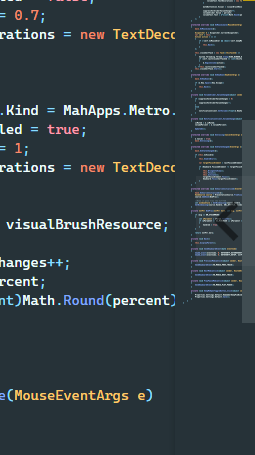
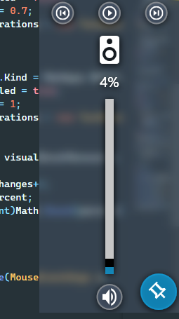
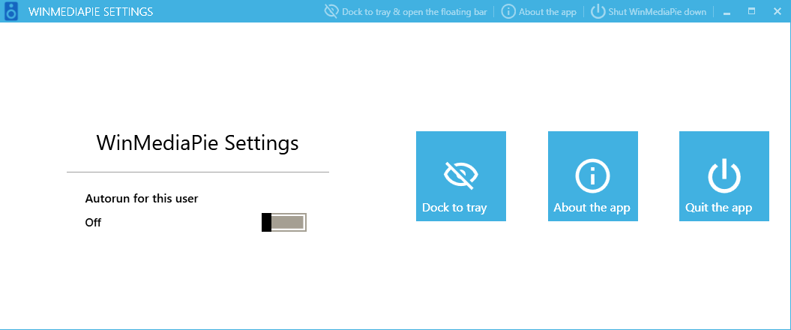

# WinMediaPie

   

### A lightweight floating volume & media playback controls sidebar for Windows 10

## Features

- Floating semi-transparent, hoverable sidebar
- Handy media playback & volume controls
- Customizable settings
- Autostart

---

## Table of Contents

- [WinMediaPie](#winmediapie)
    - [A lightweight floating volume & media playback controls sidebar for Windows 10](#a-lightweight-floating-volume--media-playback-controls-sidebar-for-windows-10)
  - [Features](#features)
  - [Table of Contents](#table-of-contents)
  - [Setup instructions](#setup-instructions)
  - [Usage](#usage)
  - [Downloads](#downloads)
  - [Screenshots](#screenshots)

---

## Setup instructions

1. Download the ZIP release for your platform (only Windows 10 x64/x86 is supported)
2. Extract it to the desired location
3. Run WinMediaPie.exe
4. Autostart with the system is by default turned on (if you don't want it, it can be disabled on the settings screen)

## Usage

1. When the app starts, on the right edge of the screen You will notice a semi-transparent arrow tile that - upon hover - opens the media control pane allowing you to:
   - control the volume with a slider
   - control media playback (play / pause, next, previous)
   - mute / unmute the sound
2. The app will show a docked icon in the taskbar, which can be clicked once to open quick actions popup or clicked twice to open the application GUI with settings & app info

## Downloads

All releases are compiled automatically thanks to GitHub actions on `v*` commits & can be found [here](https://github.com/artus9033/WinMediaPie/releases)

## Screenshots

  <figure>
    
    <figcaption>Docked sidebar (hoverable tile)</figcaption>
  </figure>

  <figure>
    
    <figcaption>Undocked semi-translucent sidebar</figcaption>
  </figure>

<figure>
  
  <figcaption>Application settings (opens on dock icon double click)</figcaption>
</figure>
